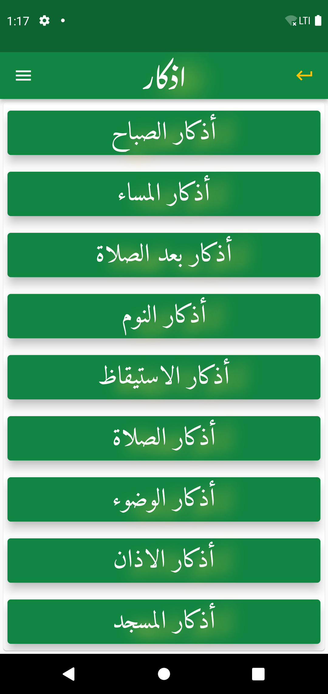
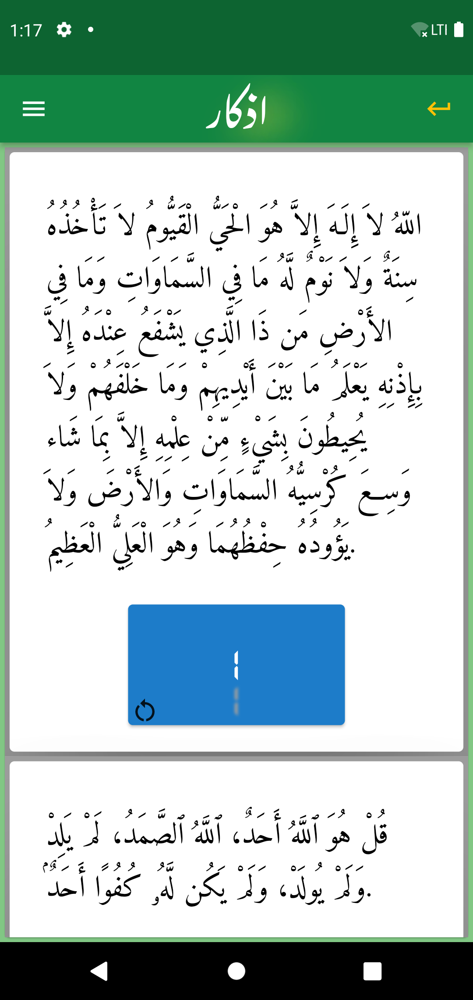
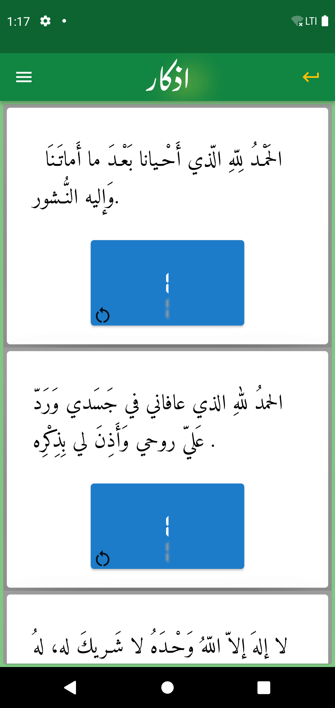
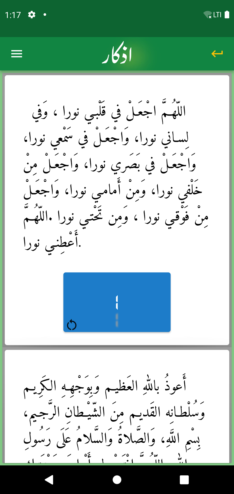
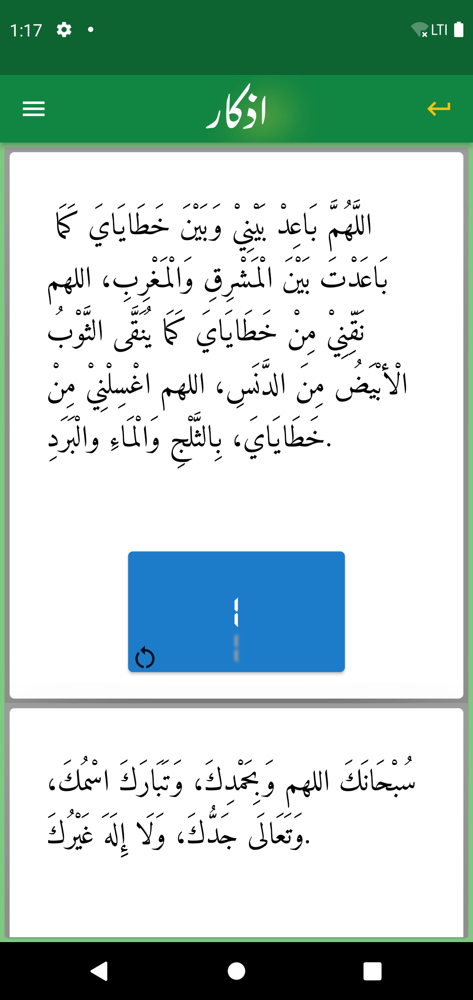

# Azkark/اذكارك

## ما هو هذا البرنامج
> __تطبيق جوال يحتوي علي بعض أذكار المسلم__
<h2>ماذا استخدمنا في هذا المشروع</h2>
<ul>
<li>لغة دارت </li>
<li>فلاتر </li>
</ul>
<h2>ماهي الباكدجات التي استخدمناها؟</h2>
<ul>
<li>google_fonts</li>
<li>cron</li>
<li>awesome_notifications</li>
<li>flutter_launcher_icons</li>
<li>flutter_native_splash</li>

</ul>

## ScreenShots 
 ### **Main Page**
* 
 -------
 ### **أذكار الصباح**
* 
 -------
 ### **أذكار المساء**
* 
 -------
 ### **أذكار بعد الصلاة**
* 
 -------
 ### **أذكار الأستيقاظ**
* 
 -------
 ### **أذكار النوم**
* 
 -------
 ### **أذكار المسجد**
* 
 -------
 ### **أذكار الصلاة**
* 
 -------
 ### **أذكار الوضوء**
* 
 -------

 ### **أذكار متفرقة**
* 

