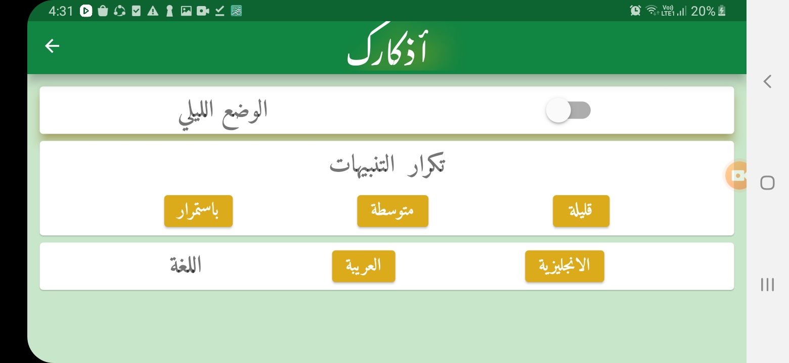

# Azkark/اذكارك

## ما هو هذا البرنامج
> __تطبيق جوال يحتوي علي أذكار المسلم و ادعية و تسابيح باللغة العربية و الانجليزية__

<h2>ماذا استخدمنا في هذا المشروع</h2>
<ul>
<li>لغة دارت </li>
<li>فلاتر </li>
</ul>
<h2>ماهي الباكدجات التي استخدمناها؟</h2>
<ul>
<li>google_fonts</li>
<li>cron</li>
<li>awesome_notifications</li>
<li>flutter_launcher_icons</li>
<li>flutter_native_splash</li>

</ul>
<h2> (notification) سيذكرك هذا البرنامج بذكر الله من خلال تنبيه</h2>

## ScreenShots 

 

<h2>Contributors: </h2>

<table>
  <tbody>
    <tr>
     <td align="center">
  
       
      <a href="https://github.com/abdelazizSalah">Abdelaziz Salah</a>
  </td>
    <td align="center">
  
       
      <a href="https://github.com/AhmedLotfy02">Ahmed Lotfy</a>
  </td>
  
  </tbody>
</table>

